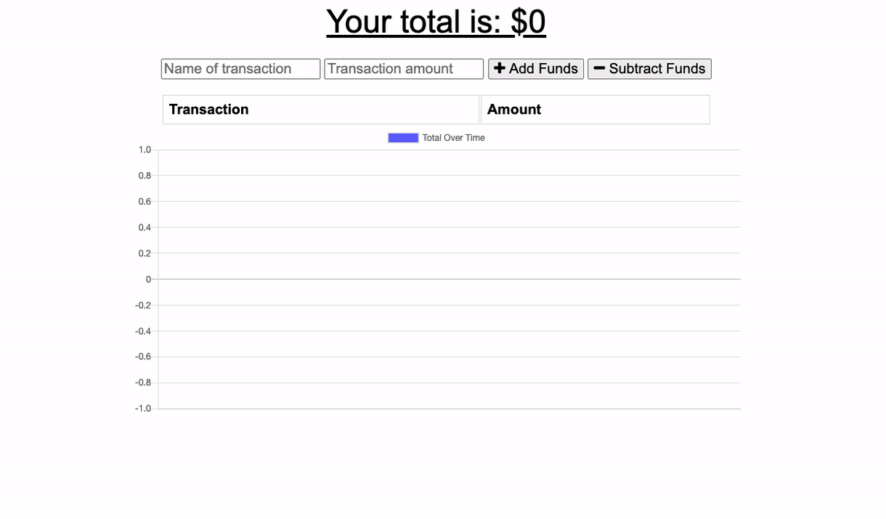

# Unit 18 PWA Homework: Online/Offline Budget Trackers

[Live Demo on Heroku](https://davenelson-budget-trackers.herokuapp.com/)

Add functionality to our existing Budget Tracker application to allow for offline access and functionality.

The user will be able to add expenses and deposits to their budget with or without a connection. When entering transactions offline, they should populate the total when brought back online.

Offline Functionality:

-   Enter deposits offline

-   Enter expenses offline

When brought back online:

-   Offline entries should be added to tracker.

## User Story

AS AN avid traveller
I WANT to be able to track my withdrawals and deposits with or without a data/internet connection
SO THAT my account balance is accurate when I am traveling

## Business Context

Giving users a fast and easy way to track their money is important, but allowing them to access that information anytime is even more important. Having offline functionality is paramount to our applications success.

## Acceptance Criteria

GIVEN a user is on Budget App without an internet connection
WHEN the user inputs a withdrawal or deposit
THEN that will be shown on the page, and added to their transaction history when their connection is back online.

---

## Commit Early and Often

-   One of the most important skills to master as a web developer is version control. Building the habit of committing via Git is important for two reasons:

1. Your commit history is a signal to employers that you are actively working on projects and learning new skills

2. Your commit history allows you to revert your code base in the event that you need to return to a previous state

-   Follow these guidelines for committing:

    -   Make single purpose commits for related changes to ensure a clean, manageable history. If you are fixing two issues, make two commits

    -   Write descriptive, meaningful commit messages so that you and anyone else looking at your repository can easily understand its history

    -   Don't commit half done work, for the sake of your collaborators (and your future self!)

    -   Test your application before you commit to ensure functionality at every step in the development process

-   We would like you to have well over 200 commits by graduation, so commit early and often!

## Submission on BCS

-   You are required to submit the following:

    -   the URL to the deployed application

    -   the URL to the Github repository
